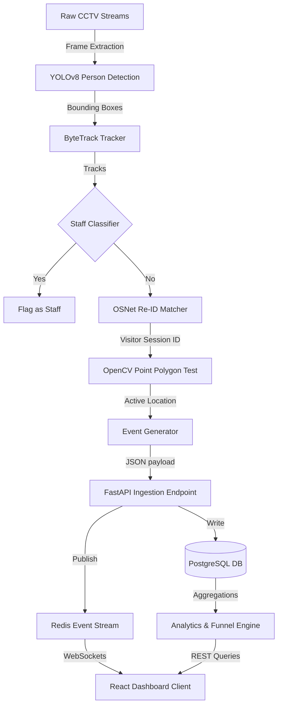

# Architectural & System Design Document

This document outlines the detailed system mechanics, CV inference methods, event stream schemas, and data structures.

---

## 1. System Architecture Diagram



---

## 2. Detection & Re-ID Pipeline Design

### Person Detection (YOLOv8)
- **Model Choice**: YOLOv8 Nano (`yolov8n.pt`) is used due to its lightweight size (~6MB), speed (>120 FPS on CPU/GPU), and high accuracy on the `person` class.
- **Confidence Threshold**: Set to `0.45` to minimize false detections (shadows, product displays) while maintaining person tracking integrity.

### Tracking (ByteTrack)
- **Concept**: ByteTrack preserves trajectories even during occlusion by matching low-score detection bounding boxes (conf between 0.1 and 0.45) with existing tracks instead of discarding them.
- **Occlusion Handling**: If a visitor is temporarily occluded behind another customer or a store pillar, the tracker buffers their track state for up to 30 frames before terminating the local ID.

### Visitor Re-ID (OSNet / OSNet-AIN)
- **Concept**: Cross-camera identity matching. When a visitor exits one camera's field of view and enters another, their identity must be unified.
- **Algorithm**: Crop the person's bounding box and pass it through a feature extraction model (OSNet) to obtain a 512-dimension embedding vector. We measure similarity using **Cosine Similarity**:
  $$\text{Similarity}(A, B) = \frac{A \cdot B}{\|A\| \|B\|}$$
- **Thresholds**: We use a default match similarity boundary of `0.75`. If matched, we link the local tracker ID to the existing `VisitorSession`.

### Staff Classification
- **Concept**: Store staff walk around the shop continuously. To avoid skewing customer conversion metrics (conversion rates, dwell counts), they must be filtered.
- **Logic**:
  1. We maintain a local registry of staff Re-ID features (taken at the start of shift).
  2. If a visitor's crop matches a staff feature vector with similarity $\ge 0.82$, we set `is_staff = True` in their `VisitorSession`.
  3. Staff sessions are excluded from the denominator in conversion and store visitor count calculations.

---

## 3. Event Schema Design & Lifecycle

Events are ingested into `POST /events/ingest`. The ingestion schemas support idempotency tracking using unique event hashes.

### JSON Schema (ZONE_ENTER Example)
```json
{
  "$schema": "http://json-schema.org/draft-07/schema#",
  "title": "ZoneEnterEvent",
  "type": "object",
  "properties": {
    "store_id": { "type": "string", "format": "uuid" },
    "camera_id": { "type": "string", "format": "uuid" },
    "event_type": { "type": "string", "enum": ["ZONE_ENTER", "ZONE_EXIT"] },
    "timestamp": { "type": "string", "format": "date-time" },
    "payload": {
      "type": "object",
      "properties": {
        "visitor_id": { "type": "string" },
        "zone_name": { "type": "string" },
        "zone_id": { "type": "string" }
      },
      "required": ["visitor_id", "zone_id"]
    }
  },
  "required": ["store_id", "event_type", "timestamp", "payload"]
}
```

### Event Lifecycle
1. **Detection**: Edge AI camera detects zone transition or queue joining.
2. **Buffering**: Local stream client groups coordinates, creates event frame, and signs it.
3. **Ingestion**: Dispatched to REST endpoint. FastAPI validates scheme via Pydantic.
4. **Session Linking**: Resolved against active sessions database (re-entry checks).
5. **Persistence**: Saved to PostgreSQL database.
6. **Live Broadcast**: Pushed to Redis Pub/Sub channels for dashboard live-updating.
7. **Aggregation**: Aggregated into hourly/daily MetricSnapshots.

---

## 4. Anomaly Engine Logic

The platform dynamically scans for the following operational anomalies:

1. **BILLING_QUEUE_SPIKE**
   - *Severity*: Critical
   - *Threshold*: Queue depth > 7 people
   - *Logic*: Scan Redis `store:{store_id}:queue_depth` buffer.
   - *Action*: Trigger push alert; suggest opening another checkout register.
   
2. **CONVERSION_DROP**
   - *Severity*: Critical
   - *Threshold*: Conversion rate < 12% over 4 hours
   - *Logic*: Check total visitor sessions vs completed transactions.
   - *Action*: Alert store manager to audit checkout speeds and sales assistants.

3. **DEAD_ZONE**
   - *Severity*: Warning
   - *Threshold*: 0 entries in a zone for 2 hours with >20 overall store entries.
   - *Logic*: Check `ZONE_ENTER` logs in Event table.
   - *Action*: Flag visual display occlusion or layout issues in that area.

4. **STALE_FEED**
   - *Severity*: Critical
   - *Threshold*: No events from camera for > 15 minutes.
   - *Logic*: Compare last event timestamp with current system clock.
   - *Action*: Dispatch hardware network diagnostic ticket.
