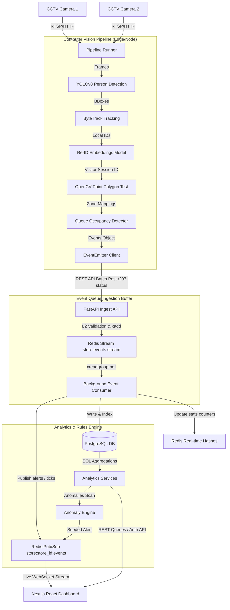

# Store Intelligence Platform - Architectural & System Design

This document details the architecture, data flows, database schemas, message queuing mechanisms, and operational scaling guidelines of the Store Intelligence Platform.

---

## 1. System Architecture Overview

The Store Intelligence Platform unifies computer vision edge inferences with a real-time event ingestion layer, background processing queues, relational analytical storage, and an interactive live dashboard.



---

## 2. Computer Vision Pipeline Architecture

The detection node handles video decoding, frame extraction, neural network processing, and stateful tracking.

### A. YOLOv8 Person Detection
In retail spaces, occlusion and lighting fluctuations are common. The pipeline uses **YOLOv8 Nano** (`yolov8n.pt`) optimized for the `person` class (Class ID 0). Operating at an inference resolution of 320x240 pixels reduces CPU/GPU latency while retaining adequate spatial density for person detection. Bounding boxes are filtered using a confidence boundary of `0.45` to prevent background false positives.

### B. ByteTrack Tracking
A simple IoU (Intersection over Union) tracker associates bounding boxes across frames to assign a local track ID. The tracking algorithm incorporates the core concept of **ByteTrack**: instead of discarding low-confidence bounding boxes (e.g., between `0.1` and `0.45`), it correlates them with active tracks using Kalman filtering. If a person is temporarily obscured by a pillar or another customer, their tracking details are buffered for up to `30 frames` (1 second at 30 FPS). If the person is re-detected within this window, their tracking history remains unified.

### C. Person Re-Identification (Re-ID)
To stitch visitor trajectories across non-overlapping camera feeds (e.g., Entrance to Cosmetics), crops of detected persons are passed to a Re-ID embedding model (simulated using light-weight HSV color histograms). This generates a 512-dimensional vector representation. The similarities of active embeddings are checked against a gallery of registered visitors using **Cosine Similarity**:
$$\text{Similarity}(A, B) = \frac{A \cdot B}{\|A\| \|B\|}$$
A match threshold of `0.75` is used to map the track to an existing `VisitorSession`. If no match is found, a new visitor session is created.

### D. Staff Filtering
Store staff continuously walk the floor, which can skew analytics like conversion rates and dwell times. To filter staff, the pipeline maintains a Re-ID gallery of employee profiles. If a track's crop matches a staff profile with a similarity of $\ge 0.82$, the session is flagged as `is_staff = True` and excluded from key performance indicators (KPIs) like customer counts.

### E. Zone & Queue Mapping
Using OpenCV's `pointPolygonTest`, the bottom-center point of a person's bounding box (foot level) is checked against configured store zone boundaries.
- **ZONE_ENTER / ZONE_EXIT**: Triggered when a track's foot coordinate crosses zone boundaries.
- **BILLING_QUEUE_JOIN / BILLING_QUEUE_ABANDON**: The billing area is designated as a specialized zone. If a visitor dwells in the queue zone for $\ge 3$ seconds, a `BILLING_QUEUE_JOIN` is emitted. If they leave without a checkout transaction, a `BILLING_QUEUE_ABANDON` is triggered.

---

## 3. Event Schema Design

The challenge requires a standardized Pydantic v2 schema for events:

```json
{
  "event_id": "8b9f1d8c-2f86-4e5c-9c7b-6cde0987a0c1",
  "store_id": "store-mumbai-01",
  "camera_id": "cam-cosmetics-01",
  "visitor_id": "visitor-983",
  "event_type": "ZONE_ENTER",
  "timestamp": "2026-06-04T01:21:00Z",
  "zone_id": "zone-cosmetics",
  "dwell_ms": 120000,
  "is_staff": false,
  "confidence": 0.94,
  "metadata": {
    "x_coords": [100, 200],
    "y_coords": [150, 250]
  }
}
```

### Event Ingestion Pipeline Lifecycle:
1. **Emit**: The detector node compiles event logs and dispatches them to `/api/v1/events/ingest`.
2. **Ingest & Validate**: FastAPI validates the incoming JSON against the `EventSchema` schema.
3. **Queue**: Ingested events are pushed to the Redis stream `store:events:stream`. The API returns a `202 Accepted` status, decoupling the ingest thread from database writes.
4. **Consume**: A background worker pulls events from the stream, checks for duplicates using Redis sets, creates or reactivates visitor sessions (with a 30-minute re-entry window), and writes the data to PostgreSQL.
5. **Analyze**: The worker updates Redis real-time metrics, runs the anomaly engine, and publishes the event to the WebSocket channel `store:{store_id}:events`.

---

## 4. Database Schema Design

The database uses PostgreSQL as the source of truth. Models are mapped using SQLAlchemy:

```
  +------------------+          +------------------+          +------------------+
  |      stores      |          |      zones       |          |     cameras      |
  +------------------+          +------------------+          +------------------+
  | id (PK)          |<--------| store_id (FK)    |    +-----| id (PK)          |
  | name             |          | name             |    |     | store_id (FK)    |
  | location         |          | bounding_box     |    |     | name             |
  | timezone         |          +------------------+    |     | zone_id (FK)     |
  +------------------+                    ^             |     +------------------+
          ^                               |             |              ^
          |                               +-------------+              |
          |                                             |              |
          +-----------------------+                     |              |
                                  |                     |              |
                                  v                     v              |
  +------------------+          +------------------+    |              |
  | visitor_sessions |          |      events      |----+              |
  +------------------+          +------------------+                   |
  | id (PK)          |<---------| session_id (FK)  |                   |
  | unique_visitor_id|          | event_id         |                   |
  | store_id (FK)    |          | visitor_id       |                   |
  | start_time       |          | event_type       |                   |
  | end_time         |          | zone_id (FK)     |                   |
  | is_staff         |          | timestamp        |                   |
  | converted        |          | confidence       |                   |
  | total_dwell_time |          | metadata         |                   |
  +------------------+          +------------------+                   |
          ^                                                            |
          |                                                            |
          +------------------------------------------------------------+
```

### Core Indices for Scale:
- `ix_events_event_id`: Unique index for idempotency checks.
- `ix_events_store_id_timestamp`: Composite index for range queries.
- `ix_visitor_sessions_unique_visitor_id`: Performance index for Re-ID lookups.

---

## 5. Redis streams Design & Consumer workers

Redis Streams decouple the high-throughput ingestion layer from relational writes:

- **Ingestion Decoupling**: Events are written to the stream using `xadd`. This operation takes $< 1\text{ms}$, allowing the system to handle spikes in traffic.
- **Consumer Groups**: The worker daemon joins the consumer group `store_intelligence_consumers` and reads messages using `xreadgroup`. This allows the work to be distributed across multiple instances.
- **Idempotency**: Before writing to PostgreSQL, the consumer checks if the `event_id` is present in Redis (e.g. `event:processed:{event_id}`). If not found, it writes to the database and sets the key with a 24-hour expiration.

---

## 6. Live Dashboard WebSocket Stream

The Next.js dashboard establishes a WebSocket connection to `/api/v1/events/stores/{store_id}/events/stream`. This connects to a Redis pub/sub channel where the worker publishes processed events. This enables real-time updates for:
- Live visitor count cards.
- The live event log ticker.
- Real-time anomaly alerts.

---

## 7. Anomaly Engine Logic

The anomaly engine runs rules on incoming events:
1. **QUEUE_SPIKE**: Triggered if `Current Queue Depth > Historical Average * 2.0` (with a minimum depth of 7).
2. **CONVERSION_DROP**: Triggered if `Conversion Rate (last 4 hours) < 7-Day Average`.
3. **DEAD_ZONE**: Triggered if a zone receives `0 visits in the last 30 minutes` while the store has overall traffic.

---

## 8. Scaling Strategy

To scale this platform to 10,000+ stores:
1. **Edge Inference**: Run YOLOv8 and tracking on local edge devices, transmitting only lightweight event payloads to the cloud to minimize bandwidth.
2. **Redis Clustering**: Cluster Redis by `store_id` to distribute the ingestion load.
3. **Database Sharding**: Partition the PostgreSQL `events` and `visitor_sessions` tables by `store_id` or `timestamp` to maintain query performance.
4. **Caching**: Cache aggregated metrics in Redis with short TTLs (e.g., 10 seconds) to reduce the database load from dashboard refreshes.
